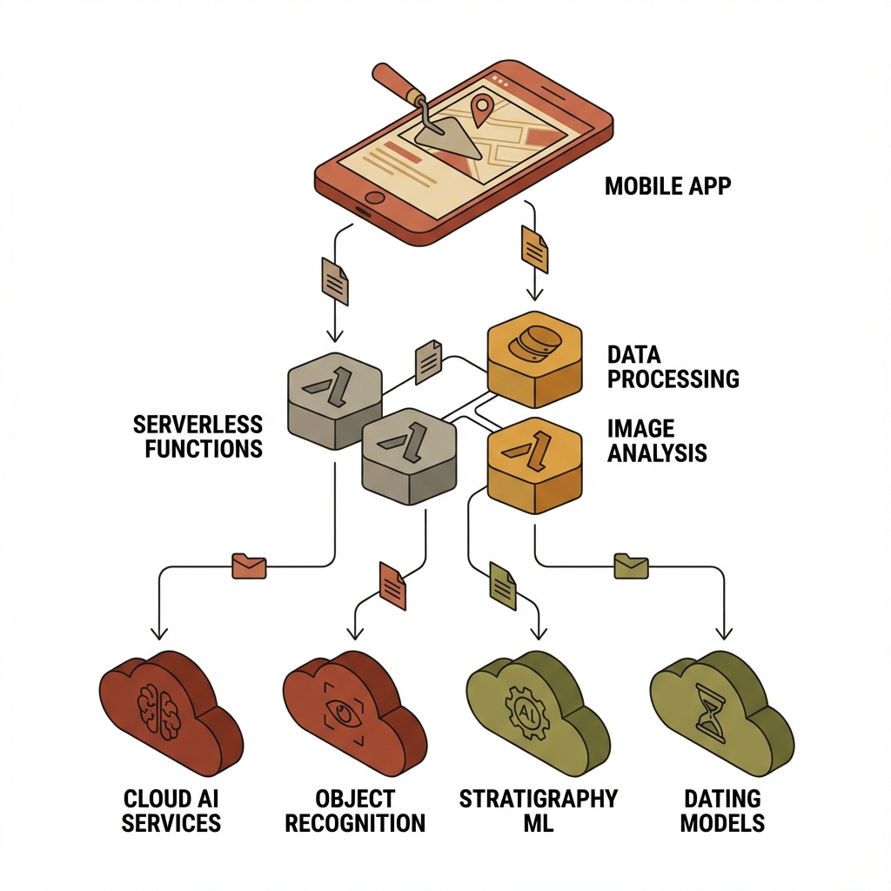

# Archaeology Web App

<div align="center">
  
</div>

A mobile-first web application for archaeological artifact documentation with AI-powered features. The app combines 3D reconstruction, AI-generated information cards, and historical colorization to help archaeologists document and analyze artifacts in the field.

## Features

### Save The Past

- **3D Reconstruction**: Generate 3D models from artifact photos using TRELLIS.2 or TripoSR (HuggingFace Spaces)
- **AI Info Cards**: Automatically generate artifact information cards with material identification, estimated age, cultural context, and preservation recommendations using Groq's Llama 3.2 90B Vision model
- **Multi-Image Capture**: Capture artifacts from multiple angles with guided camera overlay
- **Offline Support**: Core features work without internet, with automatic sync when connection is restored

### PastPalette

- **AI Colorization**: Generate multiple historically-accurate color reconstructions of artifacts using DeOldify
- **Cultural Presets**: Roman, Greek, Egyptian, Mesopotamian, and more color schemes based on historical pigment palettes
- **Before/After Comparison**: Interactive slider to compare original and colorized images
- **Bulk Export**: Download all color variants as a ZIP file with metadata

## Technology Stack

| Layer             | Technology                    | Purpose                        |
| ----------------- | ----------------------------- | ------------------------------ |
| Frontend          | React 19 + TypeScript         | User interface                 |
| Build Tool        | Vite 7                        | Development and bundling       |
| Styling           | Tailwind CSS 4                | Mobile-first responsive design |
| State Management  | Zustand                       | Lightweight global state       |
| Data Fetching     | TanStack React Query          | Server state management        |
| Local Storage     | IndexedDB (Dexie.js)          | Offline-first data persistence |
| 3D Viewer         | Three.js / @react-three/fiber | WebGL 3D model rendering       |
| Routing           | React Router 7                | Client-side navigation         |
| API Proxy         | Netlify Functions             | Secure API key handling        |
| 3D Reconstruction | TRELLIS.2 / TripoSR           | HuggingFace Spaces             |
| LLM API           | Groq (Llama 3.2 90B Vision)   | AI artifact analysis           |
| Colorization      | DeOldify                      | HuggingFace Spaces             |
| Icons             | Lucide React                  | UI iconography                 |

## Getting Started

### Prerequisites

- Node.js 18 or higher
- npm or yarn
- A Groq API key (free tier available)
- Optional: HuggingFace API token (for higher rate limits)

### Installation

1. Clone the repository:
   ```bash
   git clone <repository-url>
   cd archeology
   ```

2. Install dependencies:
   ```bash
   npm install
   ```

3. Create a `.env` file in the project root with your API keys:
   ```env
   GROQ_API_KEY=your_groq_api_key
   HF_API_TOKEN=your_huggingface_token
   ```

4. Start the development server:
   ```bash
   npm run dev
   ```

5. Open http://localhost:5173 in your browser

### Environment Variables

| Variable       | Required | Description                                                                                                                                                  |
| -------------- | -------- | ------------------------------------------------------------------------------------------------------------------------------------------------------------ |
| `GROQ_API_KEY` | Yes      | API key from [console.groq.com](https://console.groq.com) for AI info card generation                                                                        |
| `HF_API_TOKEN` | No       | HuggingFace token from [huggingface.co/settings/tokens](https://huggingface.co/settings/tokens) for higher rate limits on 3D reconstruction and colorization |

## Development Commands

| Command           | Description                                            |
| ----------------- | ------------------------------------------------------ |
| `npm run dev`     | Start development server with hot reload               |
| `npm run build`   | Build for production (TypeScript compile + Vite build) |
| `npm run preview` | Preview production build locally                       |
| `npm run lint`    | Run ESLint for code quality checks                     |

## Deployment

### Netlify Deployment

This application is designed to be deployed on Netlify with serverless functions.

1. **Connect to Netlify**:
   - Go to [app.netlify.com](https://app.netlify.com)
   - Click "Add new site" and select "Import an existing project"
   - Connect your GitHub repository

2. **Configure Build Settings**:
   - Build command: `npm run build`
   - Publish directory: `dist`
   - Functions directory: `netlify/functions`

3. **Set Environment Variables**:
   - Go to Site settings and then Environment variables
   - Add `GROQ_API_KEY` with your Groq API key
   - Optionally add `HF_API_TOKEN` for HuggingFace

4. **Deploy**:
   - Push to your main branch to trigger automatic deployment
   - Or use the Netlify CLI: `netlify deploy --prod`

### Manual Deployment

For other hosting platforms, build the application and serve the `dist` folder:

```bash
npm run build
```

Note: The Netlify Functions will not work on other platforms without modification. You would need to adapt the serverless functions to your hosting provider's equivalent (e.g., Vercel Functions, AWS Lambda).

## Project Structure

```
archeology/
├── netlify/
│   └── functions/               # Serverless API functions
│       ├── reconstruct-3d.ts    # 3D model generation
│       ├── generate-info-card.ts # AI artifact analysis
│       └── colorize.ts          # Image colorization
├── public/                      # Static assets
├── src/
│   ├── components/
│   │   ├── camera/              # Camera capture components
│   │   ├── colorization/        # PastPalette colorization UI
│   │   ├── data-management/     # Import/export dialogs
│   │   ├── detail/              # Artifact detail page components
│   │   ├── gallery/             # Artifact gallery views
│   │   ├── info-card/           # AI info card display/edit
│   │   ├── layout/              # App shell, navigation
│   │   ├── reconstruction/      # 3D reconstruction UI
│   │   ├── ui/                  # Reusable UI components
│   │   ├── viewer/              # 3D model viewer
│   ├── hooks/                   # Custom React hooks
│   ├── lib/
│   │   ├── api/                 # API client functions
│   │   ├── db/                  # Dexie.js database setup
│   │   └── utils/               # Utility functions
│   ├── pages/                   # Route page components
│   ├── stores/                  # Zustand state stores
│   ├── types/                   # TypeScript type definitions
│   ├── App.tsx                  # Root component with routing
│   ├── main.tsx                 # Application entry point
│   └── index.css                # Global styles and Tailwind config
├── docs/
│   ├── IMPLEMENTATION_PLAN.md   # Detailed development plan
│   └── API.md                   # API documentation
└── package.json
```

## Features in Detail

### Camera Capture

- Full-screen camera preview with capture controls
- Front/back camera switching
- Grid overlay for artifact centering
- Multi-angle capture guidance (front, back, sides, top)
- File upload fallback for devices without camera access
- Image compression for optimal API upload size

### 3D Reconstruction

- Two reconstruction methods:
  - TRELLIS.2 (Microsoft): High-quality 4B parameter model, best for detailed artifacts
  - TripoSR (Stability AI): Fast backup option for quick previews
- Automatic fallback if primary method fails
- Interactive 3D viewer with:
  - Orbit controls (rotate, zoom, pan)
  - Multiple lighting presets (Ambient, Museum, Outdoor)
  - Fullscreen mode
  - Screenshot capture

### AI Information Cards

- Material identification (terracotta, bronze, stone, etc.)
- Estimated age range with confidence level
- Possible function/use analysis
- Cultural context and significance
- Similar known artifacts references
- Preservation recommendations
- Clear AI disclaimer on all generated content
- Editable fields for expert corrections
- Export as JSON or PDF

### Colorization (PastPalette)

- Cultural color scheme presets:
  - Roman: Deep crimson, Tyrian purple, gold leaf, terracotta
  - Greek: Terracotta orange, black-figure pottery, red ochre, cerulean blue
  - Egyptian: Lapis lazuli blue, gold, turquoise, emerald green
  - Mesopotamian: Ultramarine blue, burnished gold, brick red
  - Weathered: Muted earth tones showing age
  - Original: Vibrant reconstruction of original colors
  - Custom: User-defined color prompt
- Before/after comparison slider
- Individual and bulk export options

### Offline Support

- All artifact data stored locally in IndexedDB
- Automatic online/offline detection
- API call queuing when offline
- Automatic sync when connection restored
- No account required - fully local-first

## Design Philosophy

- **Mobile-first**: Optimized for field use on mobile devices
- **Offline-first**: Core features work without internet
- **No accounts required**: All data stored locally
- **AI transparency**: All AI-generated content clearly marked as speculative
- **Archaeology-appropriate design**: Earthy color palette, professional feel

## Architecture Overview


<div align="center">
  
</div>


## API Documentation

See [docs/API.md](docs/API.md) for detailed API endpoint documentation.

## License

MIT
